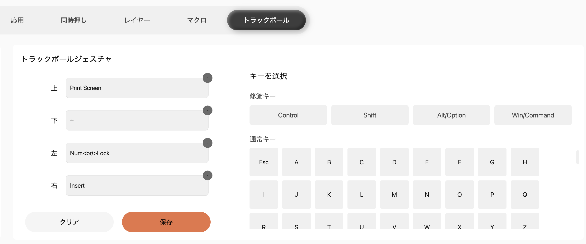

# NapeProFix

Keychron Nape Pro のトラックボールジェスチャをカスタマイズする、メニューバー常駐アプリです。

Hammerspoon も Karabiner も使いません。単体で完結します。

## 機能

- ジェスチャ4方向に、組み込み動作または任意のキーボードショートカットを割り当て
- レイヤー 0〜7。切り替えはメニューまたは登録したショートカットから
- 回転補正。オクタシフトがリセットされて向きがズレても、メニューから90°刻みで戻せる
- スクロールは連打で加速（既定 8行 → 最大32行）
- クリック時のカーソル固定。押す・離す瞬間のボールの回転でクリック位置がずれるのを防ぐ
- ログイン時に起動

## ビルド

```sh
swift build
swift test
```

アプリバンドルを作る場合:

```sh
./scripts/build-app.sh
cp -R /tmp/napeprofix-stage/NapeProFix.app /Applications/
```

初回起動時にアクセシビリティ権限を求められます。許可すると数秒で自動的に有効になります（アプリの再起動は不要）。

`build-app.sh` はキーチェーンの Apple Development / Developer ID 証明書で署名します（`NAPEPROFIX_SIGN_IDENTITY` で明示指定も可能）。署名IDが安定していれば、再ビルドしてもアクセシビリティの許可は維持されます。プロジェクトがGoogleドライブ上にあると拡張属性が即座に復活して `codesign` が失敗するため、アプリバンドルは `/tmp/napeprofix-stage` で組み立てて署名しています。

配布用の DMG を作る場合:

```sh
./scripts/make-dmg.sh
```

`build/NapeProFix-<バージョン>.dmg` ができます（例: `NapeProFix-1.1.0.dmg`）。ドラッグでインストールできるよう `Applications` へのシンボリックリンク付きです。公証はしていません（Developer ID Application 証明書が必要なため）。署名は Apple Development 証明書で、これは開発用のものです。

**別の Mac に持っていく場合**、Gatekeeper に止められます。macOS 15 以降は右クリック →「開く」では回避できません。次のどちらかで開いてください。

- システム設定 → プライバシーとセキュリティ を開き、下部に出る「このまま開く」を押す
- または、コピー先の Mac で一度だけ次を実行する

```sh
xattr -dr com.apple.quarantine /Applications/NapeProFix.app
```

どの Mac でもそのまま開けるようにするには、Apple Developer Program に登録して Developer ID Application 証明書を取得し、署名 → 公証 → ステープルまで行う必要があります。

アイコンはコードから生成します。

```sh
swift scripts/make-icon.swift "$PWD"
```

## Keychron Launcher 側の設定

**アドバンスモード > 「常にジェスチャーモードを有効にする」をオンにしてください。** オフの場合、ジェスチャは「ボールジェスチャ」を割り当てたボタンを押している間しか発火しません。

トラックボールジェスチャの4方向には、**修飾キーなしで**以下を割り当てます。

| 方向 | 通常キー | macOS |
|---|---|---|
| 上 | Print Screen | f13 |
| 下 | ÷（テンキー） | pad/ |
| 左 | Num Lock | padclear |
| 右 | Insert | help |



この内容はアプリのメニュー「動かないとき / Launcher の設定…」からいつでも確認できます。初回起動時には自動で表示されます。

Launcher が Num Lock を `Num<br/>Lock` と表示することがありますが、これは Launcher 側の表示上の不具合です。設定内容としては正しいので、そのままで問題ありません。

### 修飾キーを使ってはいけない理由

Launcher で修飾キーを付けると、**ジェスチャ1回ごとにその修飾キーが完全に押されて離されます**。連続で転がすと Option 連打になり、アプリ側が誤反応します。

これはアプリ側では対処できません。`flagsChanged` は文字キーより先に届くため、届いた時点ではジェスチャの一部か通常のキー入力かを判別できず、デバイス識別も不可能です（`keyboardEventKeyboardType` が内蔵キーボードと同じ値を返します）。

上記の4キーは Mac のキーボードに存在せず、素で押しても何も起きないため、修飾キーなしで安全に使えます。

### 使えないキー

| キー | 理由 |
|---|---|
| Pause | macOS でキーコードを持たず、イベントごと消える |
| Scroll Lock | F14 になる。旧 Mac キーボードの輝度ダウンとしてシステムが低レイヤーで消費するため、どのアプリも横取りできない |

## レイヤー切替キーの選び方

レイヤー切替のキーは固定ではなく、設定画面の「記録…」から自分で登録します。選ぶときの判断材料は次のとおりです。

**このアプリは入力元のデバイスを区別できません。** イベントタップにデバイス情報が乗らないためです（Nape Pro もキーボードも `keyboardEventKeyboardType` が同じ値を返します）。登録したキーはキーボードから直接押しても同じ動作になり、そのキーは他のアプリからは使えなくなります。

つまり「システム全体で犠牲にしていいキー」を選ぶ必要があり、どこで犠牲を払うかの選択になります。

| | テンキー付きの Mac で | 他アプリのショートカットと |
|---|---|---|
| テンキー系（`×` など） | 衝突する | 衝突しない |
| `⌃⌥` + 英字 | 衝突しない | 衝突しうる |

なお「修飾キーを付けるとジェスチャ1回ごとに押されて離される」問題は、転がすたびに連続発火するジェスチャ固有のものです。ボタンの押下は1回きりなので、レイヤー切替には修飾キー付きの組み合わせを使って構いません。

## Launcher を初期化したときの復旧

初期化するとジェスチャのキー割り当てが消えますが、**オクタシフトの回転設定も既定値に戻ります**。キーだけ入れ直すと向きがズレたままになります。

回転はデバイス側とアプリ側の両方にあるため、片方だけ変えると必ずズレます。キーを入れ直したあと、アプリのメニューで「0°に戻す」、それでもズレていれば「90°回す」で合わせてください。

## バージョン

`メジャー.マイナー.パッチ` の3桁で表記し、`Resources/Info.plist` の `CFBundleShortVersionString` で管理します。設定画面の右下に表示されます。

`CFBundleVersion` はビルドのたびに増やしますが表示しません。macOS が単調増加するビルド番号を要求するために置いているもので、必要になったら Finder の情報ウインドウで確認できます。

変更履歴は [CHANGELOG.md](CHANGELOG.md) にあります。

## 制約

- ジェスチャは4方向のみです。ファームウェアが斜めを区別して送らないため、8方向にはできません
- バッテリー残量は取得できません。デバイスが HID でバッテリーの UsagePage を公開していないためです
- デバイス側のレイヤーとアプリのレイヤーは連動しません。届くのがキーコードだけで、レイヤー情報が乗ってこないためです

## ライセンス

MIT License。詳細は [LICENSE](LICENSE) を参照してください。

## 作者へ

個人的に作ったものを公開しています。動作保証やサポートはありません。Issue や PR は歓迎しますが、対応をお約束はできません。

役に立ったら [ほしい物リスト](https://www.amazon.co.jp/hz/wishlist/ls/WFRWJC8J65NF) から何か送ってもらえると喜びます。
